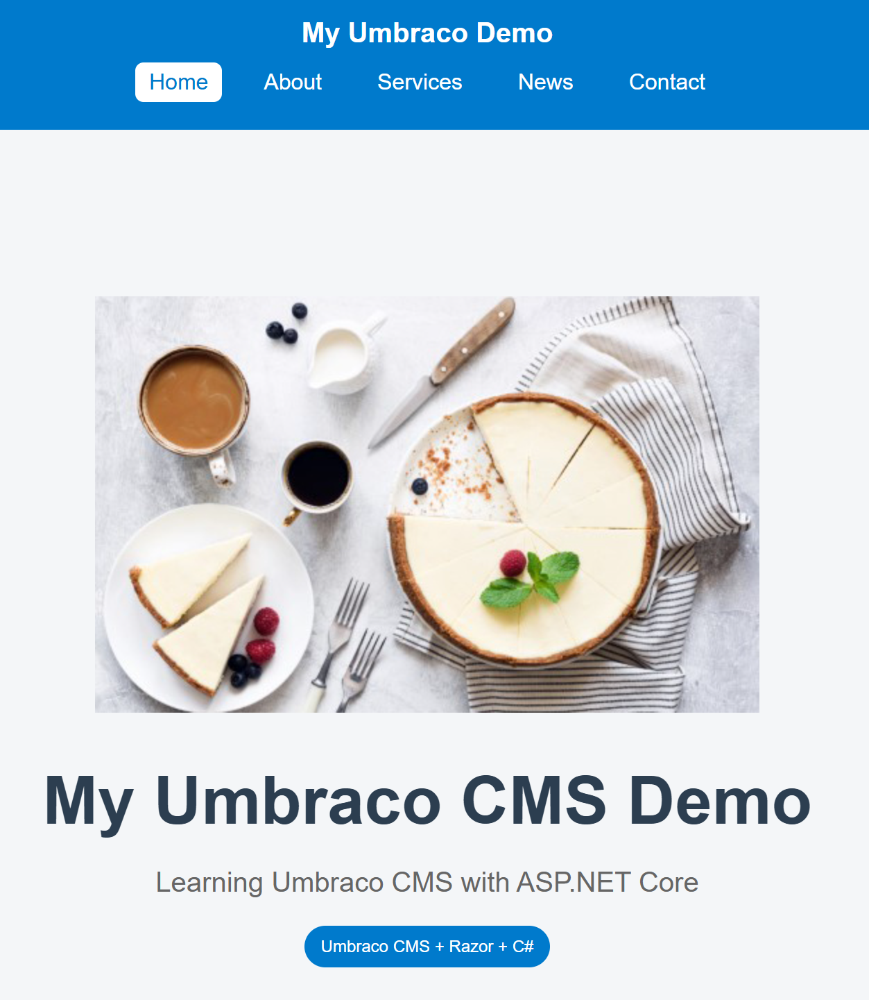
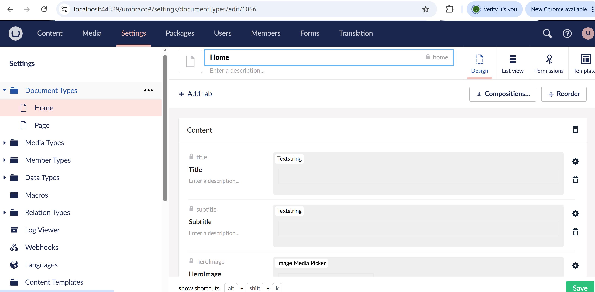
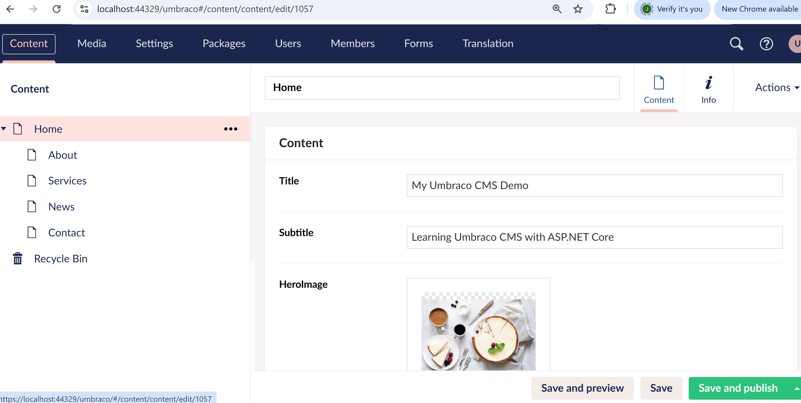
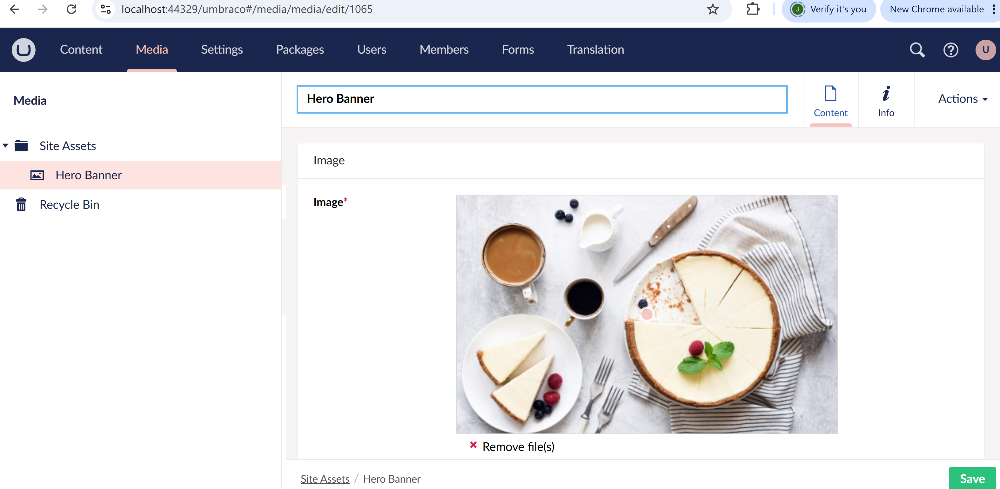

# Umbraco CMS Demo

A simple CMS-driven website built with **ASP.NET Core** and **Umbraco CMS**.

## Features
- Dynamic navigation (Home, About, Services, News, Contact)
- Editable content using Umbraco backoffice
- Media library support (images)
- Razor views for layout and templates
- Basic front-end styling with CSS

## Technologies
- C# / ASP.NET Core 8
- Umbraco CMS 13.5
- Razor Views
- HTML5, CSS3

## Screenshots

### Front-end

### Umbraco Backoffice

## How to run locally
1. Clone the repo
2. Install .NET 8 SDK
3. Run `dotnet restore` and `dotnet run`
4. Navigate to `https://localhost:44329/umbraco` for backoffice
5. Navigate to `https://localhost:44329` for front-end

## Demo
- [GitHub Repository](https://github.com/jdongob/umbraco-cms-site)
